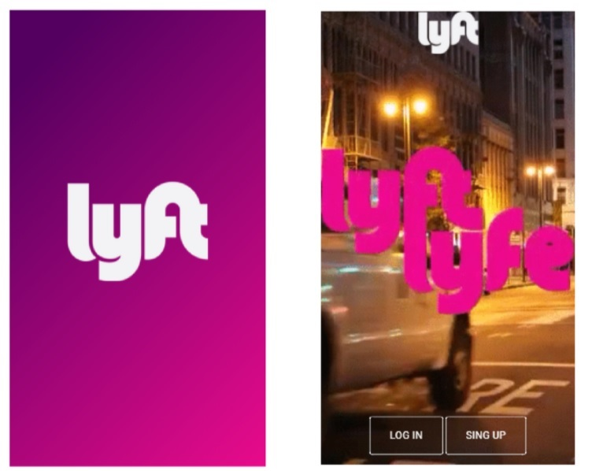
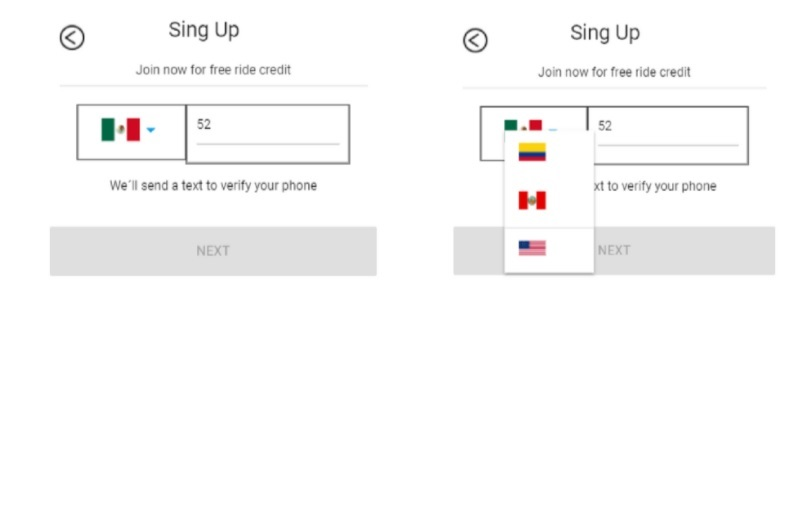
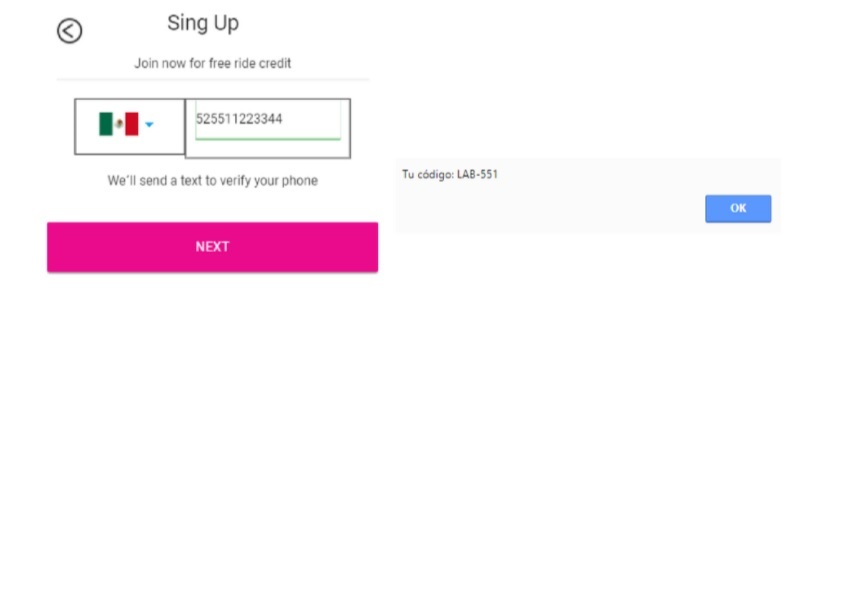
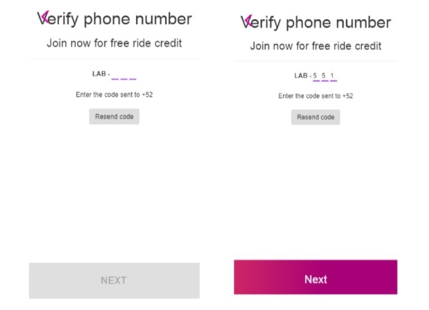
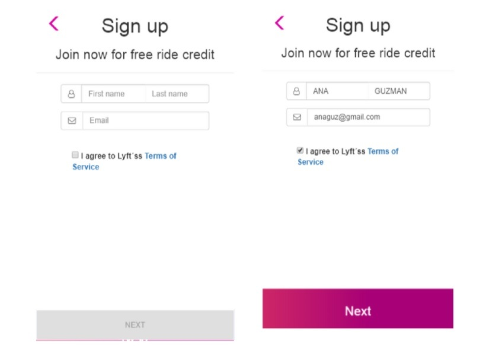
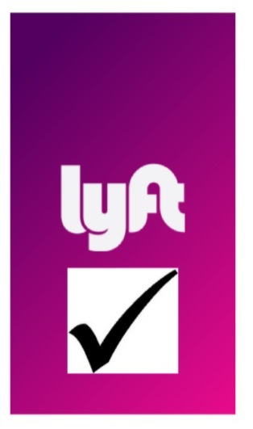

# LYFT

Web-app que replique el registro del sitio de Lyft correctamente validada. Ingresa un teléfono de 10 dígitos y sigue los pasos.

## Lo que se utilizó en este proyecto

* Html 5.2
* Css
* JQuery
* Boostrap
* Google Fonts
* Fontawesome

## Desarrollado para 
[Laboratoria](http://laboratoria.la)

*Autor: Kamaly Zapana Lorenzo*

* **Descripcion General:** _Web-app con diseño libre, utilizamos JQUERY Y BOOTSTRAP_
* **Reto** 
* **Contenido** 
* **Visualiza el restultado final** : 
***

## Reto

El reto consiste en desarrollar una web-app que replique el sitio de Lyft, en este reto deberás cumplir los pasos necesarios para que tu usuario pueda registrarse.
## Flujo de la aplicación

* Vista splash con duración de 2 a 5 segundos que redirecciona a tu vista de inicio. 

* En la siguiente vista tenemos un formulario donde nuestro usuario puede escoger el país y debe ingresar su número de teléfono. El botón de NEXT debe estar deshabilitado hasta que se ingrese un número de 10 dígitos.  

* Una vez ingresado el número de teléfono se habilita el botón y al dar click debe enviar una alerta con un código generado aleatoriamente (LAB-000) y redireccionar a la siguiente vista.  

* En esta vista se debe ingresar el código dado anteriormente y una vez hecho esto se habilita el botón que redirecciona a nuestro usuario a la vista donde ingresa sus datos. (Puede tener la opción de enviar otro código.)   

* Para ingresar sus datos necesitamos un formulario que le pida su nombre, apellido y correo electrónico. Deberá también tener un checkbox para que se acepten los términos y condiciones del servicio.   

* Ya que se ha realizado lo anterior, sólo se deberá mostrar una vista al usuario que le indique que ha concluido con el registro exitosamente.  
 
 

## Contenido

* En el archivo base `index.html` se encuentra el maquetado.

* En la carpeta `css` se encuentra elarchivo base `main.css` donde se encuentran los estilos necesarios no realizacionados al bootstrap.

* En la carpeta `js` se encuentra elarchivo base `app,js` donde se encuentra toda la funcionalidad en jquery.

* En la carpeta `Vendors` se encuentra los archivos del framework utilizado.

 **Autora:** _Kamaly Zapana Lorenzo_

